# MiniTen Inference Serving

MiniTen is a local-first inference serving platform for deploying Hugging Face
LLMs as named vLLM workers on Kubernetes. It includes a Flask API, server-rendered
web dashboard, CLI, Postgres metadata store, Kubernetes deployment worker, and
OpenAI-compatible inference routes.

The current project is an implemented MVP. It is intended to run locally with
Docker, Docker Compose, and kind, with a later production path toward OCI/OKE.


## What It Does

MiniTen lets you:

- Create users and log in.
- Create projects and manage project members.
- Create project-scoped API keys for inference.
- Deploy named model services backed by vLLM.
- Start, stop, scale, retry, sync, and delete model deployments.
- View model status, jobs, logs, analytics, and lifecycle events.
- Send OpenAI-compatible `/v1/chat/completions` requests.
- Use the same workflows from the web dashboard or `miniten` CLI.

The Flask app is the control plane and request router. vLLM pods do the actual
model inference.

## Prerequisites

Install these before running the project locally:

- Python 3.12
- Docker Desktop or Docker Engine
- Docker Compose
- `kind`
- `kubectl`
- `make`

Package manager examples:

macOS with Homebrew:

```bash
brew install python@3.12 docker docker-compose kind kubectl make
```

Windows with Chocolatey:

```powershell
choco install python docker-desktop docker-compose kubernetes-cli kind make -y
```

Debian/Ubuntu:

```bash
sudo apt-get update
sudo apt-get install -y python3 python3-pip make ca-certificates curl

# Docker Engine: https://docs.docker.com/engine/install/ubuntu/
# kubectl: https://kubernetes.io/docs/tasks/tools/install-kubectl-linux/
# kind:
curl -Lo ./kind https://kind.sigs.k8s.io/dl/v0.23.0/kind-linux-amd64
chmod +x ./kind
sudo mv ./kind /usr/local/bin/kind
```

## Quick Start: Web Dashboard

This is the recommended local workflow.

```bash
make setup-web
```

`make setup-web` does the full local setup:

- Installs Python dependencies with Poetry.
- Starts Postgres with Docker Compose.
- Runs database migrations.
- Creates or reuses a local kind cluster named `miniten`.
- Installs/patches metrics-server for local HPA autoscaling.
- Starts the deployment worker with real Kubernetes access.
- Starts the Flask API/dashboard in the background.
- Opens the dashboard in your browser.

The dashboard runs at:

```text
http://127.0.0.1:8000
```

To reopen or restart the dashboard after setup:

```bash
make open-dashboard
```

To stop the background API/dashboard, remove local Compose state, and stop the
local kind node while preserving its PVC/cache data:

```bash
make clean-env
```

`make clean-env` stops the kind node container instead of deleting it. That
frees Docker Desktop memory while preserving cached pod images and PVC data such
as Hugging Face model downloads. Use `make clean-kind` or `make clean-all` when
you want to delete the cluster and its cache.

## Manual Local Workflow

Use this when you want the API server in the foreground:

```bash
make setup-env
make start-worker-real-k8s
make run-api
```

Then open:

```text
http://127.0.0.1:8000
```

Important: `make setup-env` refuses to run while port `8000` is already
listening. Stop the API first, or run `make clean-env`.

## Make Commands

Common commands:

```bash
make install
make setup-env
make setup-web
make open-dashboard
make clean-env
make start-kind
make stop-kind
make clean-kind
make clean-all
make install-metrics-server
make migrate
make run-api
make run-worker
make run-worker-dry-run
make start-worker-real-k8s
make test
make test-local-apis
make test-local-k8s
make test-local-vllm
make test-local-vllm-gpu
make tests
make coverage
make lint
make compile
make clean
```

What the important targets do:

| Target | Purpose |
|---|---|
| `make install` | Installs Poetry and project dependencies. |
| `make setup-env` | Starts Postgres, runs migrations, creates kind, starts dry-run Compose workers. |
| `make setup-web` | Runs setup, switches Compose workers to real Kubernetes, starts dashboard/API, opens browser. |
| `make open-dashboard` | Starts or reopens the local dashboard/API. |
| `make start-worker-real-k8s` | Restarts Compose workers with `WORKER_DRY_RUN=false`. |
| `make run-api` | Runs Flask API/dashboard in the foreground. |
| `make run-worker` | Runs the deployment worker in the foreground using real Kubernetes. |
| `make run-worker-dry-run` | Runs the worker without mutating Kubernetes. |
| `make clean-env` | Stops local API, removes Compose services/volumes, stops kind, clears setup marker. |
| `make start-kind` | Starts an existing local kind node without deleting PVC/cache data. |
| `make stop-kind` | Stops the local kind node without deleting PVC/cache data. |
| `make clean-kind` | Deletes the local kind cluster. |
| `make clean-all` | Runs `clean-env` and `clean-kind`. |
| `make install-metrics-server` | Installs/patches metrics-server in the local kind cluster for HPA autoscaling. |
| `make test` | Runs the Python unit test suite. |
| `make test-local-apis` | Runs API smoke tests against a running local API. |
| `make test-local-k8s` | Tests real Kubernetes resource creation/deletion with a lightweight smoke worker. |
| `make test-local-vllm` | Deploys a real CPU vLLM pod and calls chat completions. |
| `make test-local-vllm-gpu` | Runs the GPU vLLM smoke path when Kubernetes exposes `nvidia.com/gpu`. |
| `make tests` | Runs `make test`, `make test-local-apis`, `make test-local-k8s`, and `make test-local-vllm`. |
| `make lint` | Runs Ruff. |

## Web Dashboard Workflow

After `make setup-web`, use the browser to:

1. Register an account.
2. Log in.
3. Create a project.
4. Create a project API key.
5. Deploy a model.
6. Watch the model page for status, jobs, logs, and analytics.
7. Send an inference request from the Inference page.

For a low-memory local CPU deployment, use:

| Field | Value |
|---|---|
| Model name | `small-llm` |
| Hugging Face model ID | `HuggingFaceTB/SmolLM2-135M-Instruct` |
| Replicas | `1` |
| CPU request | `1` |
| CPU limit | `4` |
| Memory request | `1Gi` |
| Memory limit | `6Gi` |
| GPU count | `0` |
| Dtype | `auto` |
| Max model length | `256` |
| Autoscaling | `false` |

The first vLLM startup can take a while because the model image and model files
may need to download.

## Application Tour

The dashboard is organized around the same workflow exposed by the CLI: create
an account, create a project, deploy a model, manage runtime state, and call the
model through an OpenAI-compatible API.

### Home

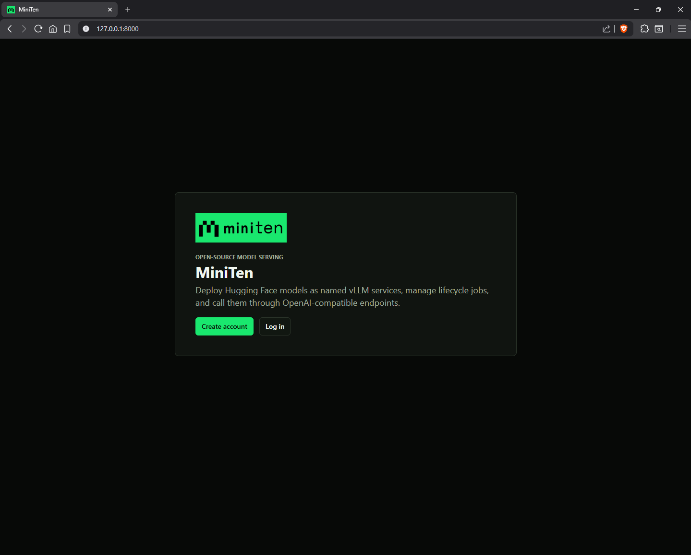

The home page is the entry point for local dashboard users. From here you can
create an account or log in to an existing MiniTen account.

### Account Creation

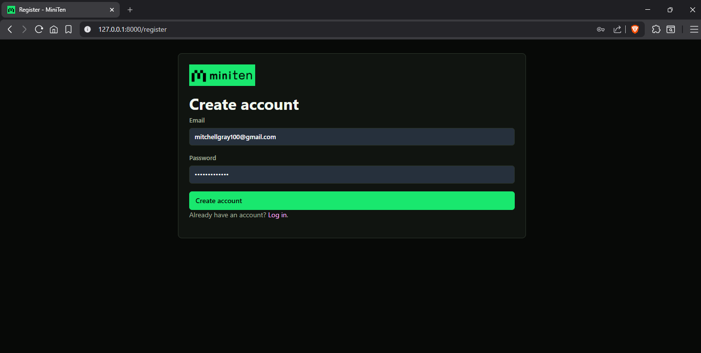

The account creation page registers a dashboard user. User accounts own and
manage projects, API keys, project members, and model deployments.

### Login

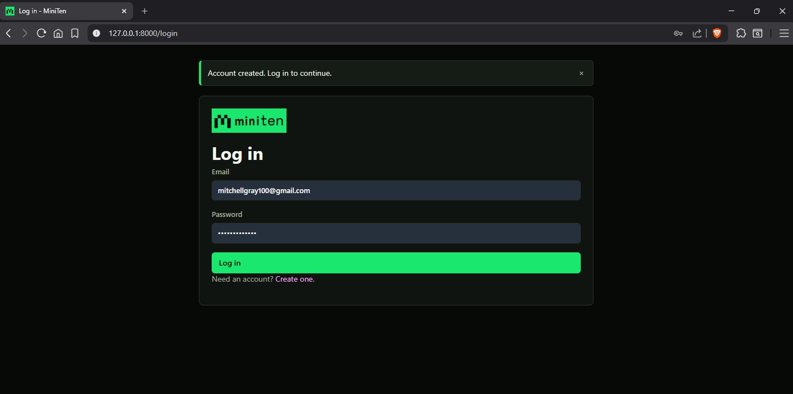

The login page creates the browser session used for project and model
management. It preserves your email if login fails so retrying does not clear
the form.

### Projects

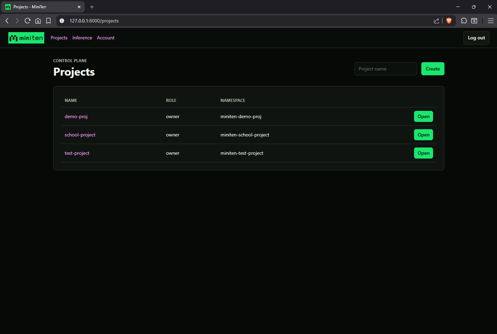

The Projects page lists the projects you can access, their Kubernetes
namespaces, and your role in each project. It also lets you create new projects.
A project is the main isolation boundary for API keys, members, model
deployments, analytics, and Kubernetes resources.

### Project Dashboard

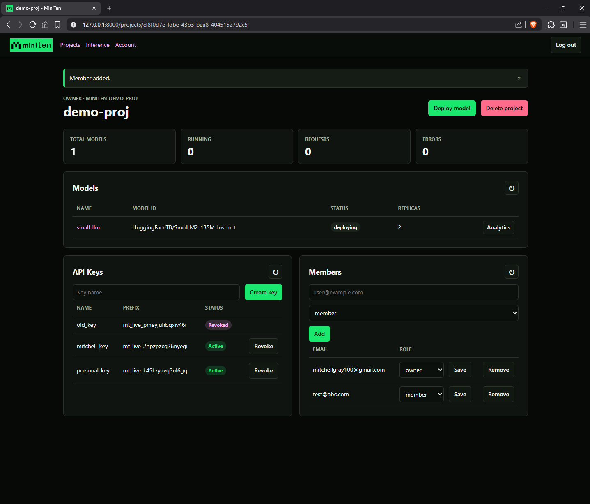

The project dashboard is the main workspace for a project. It shows project
totals, model deployments, project API keys, and project members. From this page
you can deploy a model, open model analytics, create or revoke API keys, invite
members, change member roles, remove members, and delete the project.

### API Key Creation

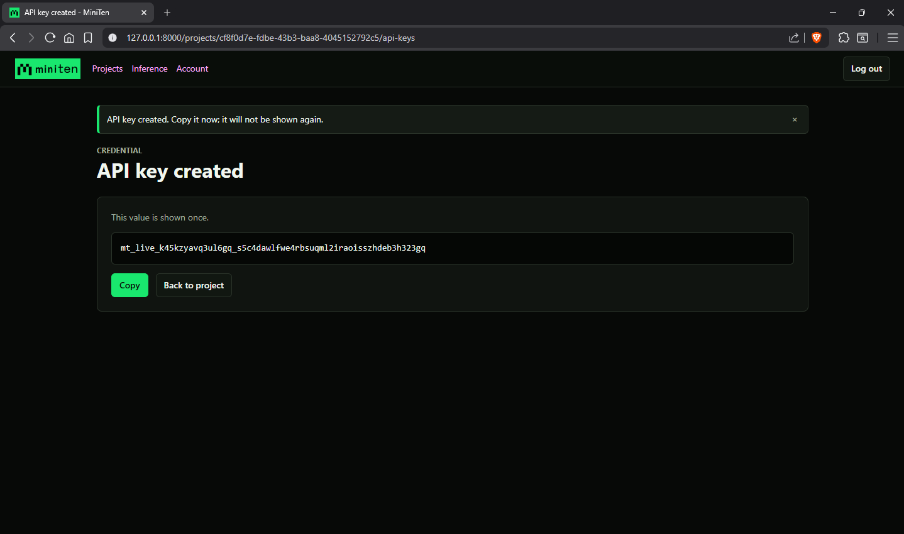

API keys are project-scoped credentials used for inference requests. MiniTen
shows the raw key only once when it is created. Later pages show safe metadata
such as status and stored key prefix, but never the full credential.

### Model Deployment

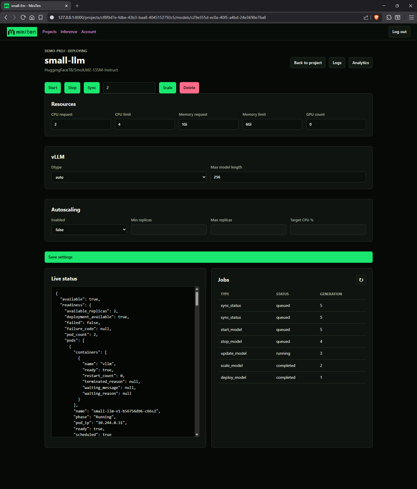

The model deployment page manages one named model service. It shows the current
status, Kubernetes readiness details, deployment jobs, and model settings. You
can start, stop, retry, sync, scale, update, delete, view logs, and open
analytics for the model. The live status box is scrollable so Kubernetes
diagnostics stay readable without expanding the whole page.

### Analytics

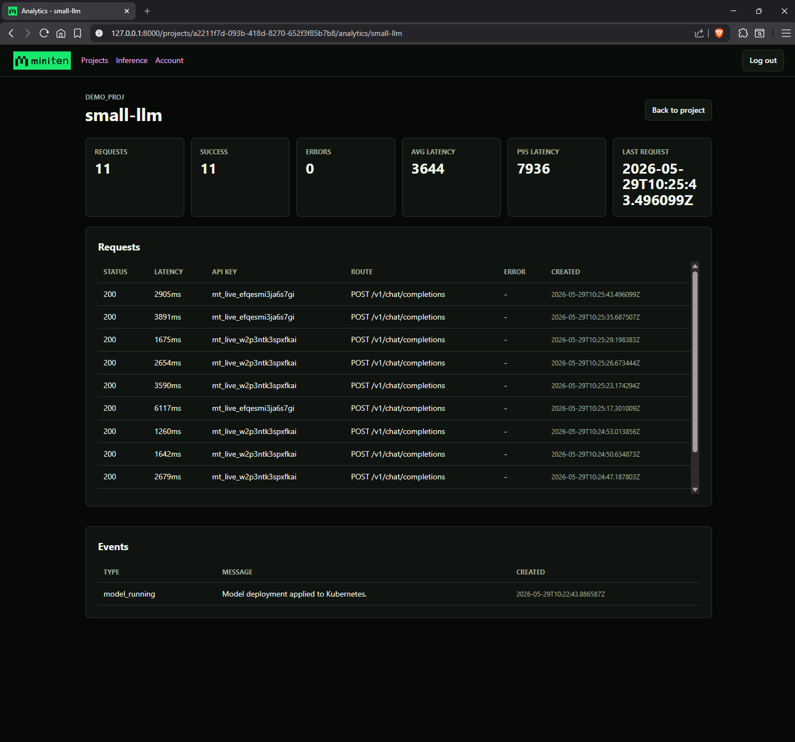

The analytics page shows request counts, success/error totals, average latency,
p95 latency, recent requests, and lifecycle events. Recent request rows include
the stored API key prefix, status code, latency, route, error type, and request
time. MiniTen stores request metadata only; prompts and model responses are not
persisted.

### Inference

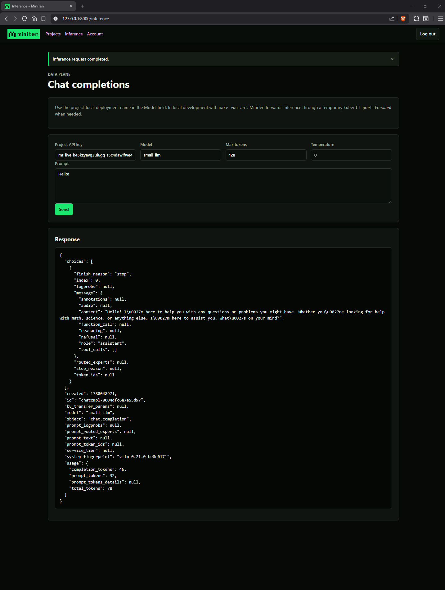

The Inference page lets you test a deployed model from the browser with a
project API key. It can stream OpenAI-compatible chat completion deltas as they
arrive while also preserving the full HTTP response for inspection.

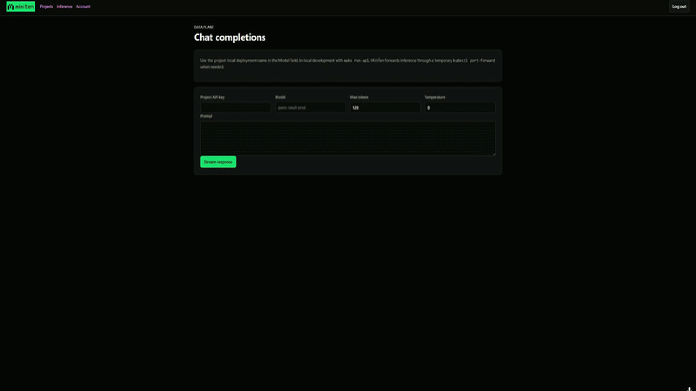

### OpenAI SDK / Notebook Usage

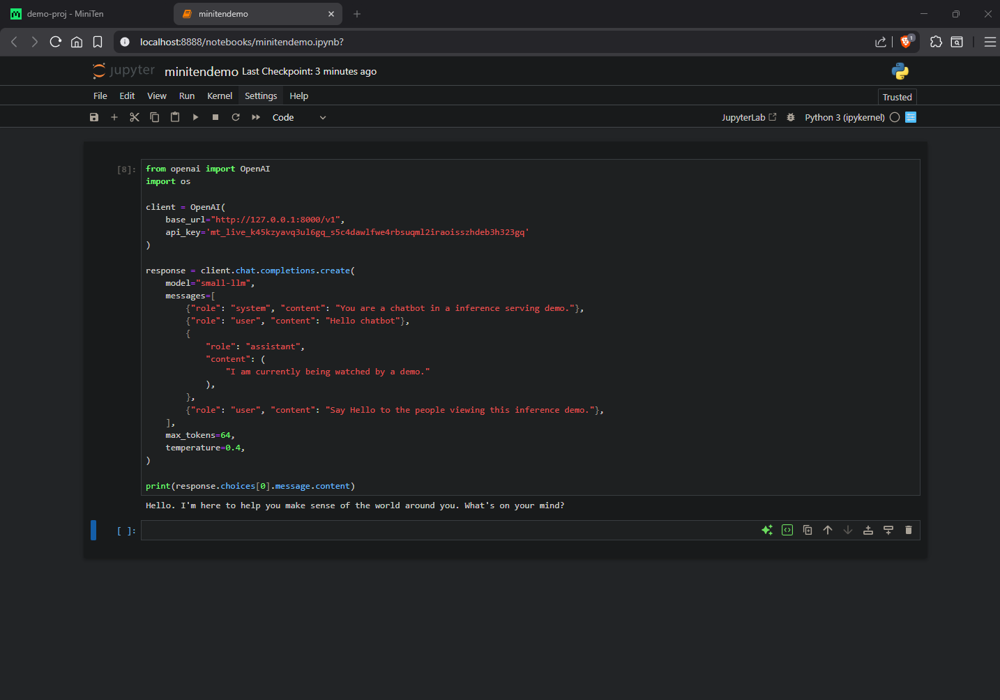

MiniTen can also be called from client code using an OpenAI-compatible base URL.
The notebook-style workflow uses the project API key, points the SDK at
`http://127.0.0.1:8000/v1`, and sends requests to the MiniTen model deployment
name.

Example notebooks are available in `examples/minitendemo.ipynb` and
`examples/minitendemo_streaming.ipynb`.

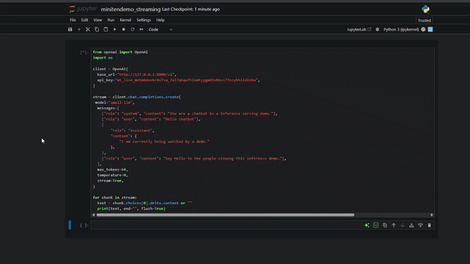

### Account

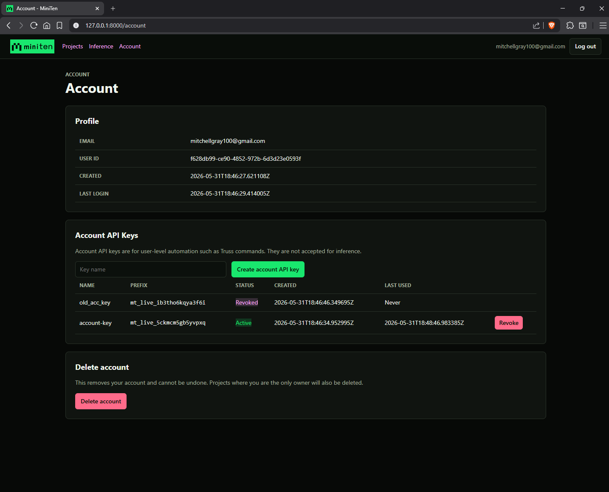

The Account page shows account metadata and contains the account deletion
control. Account deletion is separated from project management so destructive
account-level actions are not mixed into the project list. Deleting an account
also deletes projects where that account is the only owner; assign another
owner first if a project should remain after the account is removed.

## CLI

The `miniten` CLI uses the same HTTP API as the dashboard. Control-plane
commands use your user login token. Inference commands use a project API key.

Configure the local API URL:

```bash
python -m poetry run miniten config set-url http://127.0.0.1:8000
python -m poetry run miniten config show
```

Top-level help now includes command inputs:

```bash
python -m poetry run miniten -h
```

Current top-level help:

```text
usage: miniten [-h]
               {config,auth,projects,members,api-keys,models,inference,analytics}
               ...

MiniTen command-line client for the dashboard/API.

positional arguments:
  {config,auth,projects,members,api-keys,models,inference,analytics}

options:
  -h, --help            show this help message and exit

command reference:
  config set-url <url>
  config show

  auth register --email <email> [--password <password>]
  auth login --email <email> [--password <password>]
  auth logout
  auth me
  auth delete-user [--yes]

  projects create <name>
  projects list
  projects get <project-id>
  projects delete <project-id> [--yes]

  members list <project-id>
  members add <project-id> --email <email> --role {owner,member,viewer}
  members update <project-id> <user-id> --role {owner,member,viewer}
  members remove <project-id> <user-id>

  api-keys create <project-id> <name> [--use]
  api-keys list <project-id>
  api-keys use <project-api-key>
  api-keys revoke <project-id> <api-key-id>

  models deploy <project-id> --name <name> --model-id <hf-model-id>
      [--replicas <n>] [--cpu-request <value>] [--cpu-limit <value>]
      [--memory-request <value>] [--memory-limit <value>] [--gpu-count <n>]
      [--dtype <dtype>] [--max-model-len <tokens>]
      [--autoscaling-enabled {true,false}] [--min-replicas <n>]
      [--max-replicas <n>] [--target-cpu-utilization <percent>]
      [--json <json-object>]
  models list <project-id>
  models get <project-id> <model-deployment-id>
  models update <project-id> <model-deployment-id> [model settings options]
      [--json <json-object>]
  models start <project-id> <model-deployment-id>
  models stop <project-id> <model-deployment-id>
  models retry <project-id> <model-deployment-id>
  models sync <project-id> <model-deployment-id>
  models scale <project-id> <model-deployment-id> <replicas>
  models hard-restart <project-id> <model-deployment-id> [--yes]
  models delete <project-id> <model-deployment-id> [--yes]
  models jobs <project-id> <model-deployment-id>
  models status <project-id> <model-deployment-id>
  models logs <project-id> <model-name> [--tail <lines>]

  inference chat [--api-key <project-api-key>] [--model <name>]
      [--prompt <text>] [--max-tokens <n>] [--temperature <float>]
      [--stream] [--json <json-object>]
  inference models [--api-key <project-api-key>]

  analytics overview <project-id>
  analytics metrics <project-id> <model-name> [--since <iso8601>]
  analytics requests <project-id> <model-name> [--since <iso8601>]
      [--limit <n>] [--status-code <code>]
  analytics events <project-id> <model-name>

Run `miniten <group> <command> -h` for detailed help on one command.
```

### CLI Example: Full Local Flow

Register and log in:

```bash
python -m poetry run miniten auth register --email user@example.com
python -m poetry run miniten auth login --email user@example.com
```

Create and inspect a project:

```bash
python -m poetry run miniten projects create "Personal Models"
python -m poetry run miniten projects list
```

Deploy a small CPU model:

```bash
python -m poetry run miniten models deploy <project-id> \
  --name small-llm \
  --model-id HuggingFaceTB/SmolLM2-135M-Instruct \
  --replicas 1 \
  --cpu-request 1 \
  --cpu-limit 4 \
  --memory-request 1Gi \
  --memory-limit 6Gi \
  --gpu-count 0 \
  --dtype auto \
  --max-model-len 256 \
  --autoscaling-enabled false
```

Check model state:

```bash
python -m poetry run miniten models list <project-id>
python -m poetry run miniten models jobs <project-id> <model-deployment-id>
python -m poetry run miniten models status <project-id> <model-deployment-id>
python -m poetry run miniten models logs <project-id> small-llm --tail 100
```

Create and save a project API key:

```bash
python -m poetry run miniten api-keys create <project-id> local-dev --use
python -m poetry run miniten api-keys list <project-id>
```

Send inference:

```bash
python -m poetry run miniten inference chat \
  --model small-llm \
  --prompt "Say hello in one short sentence." \
  --max-tokens 32 \
  --temperature 0
```

Stream inference:

```bash
python -m poetry run miniten inference chat \
  --model small-llm \
  --prompt "Say hello in one short sentence." \
  --max-tokens 32 \
  --temperature 0 \
  --stream
```

### OpenAI SDK Compatibility

MiniTen's inference routes are compatible with the OpenAI Python SDK for both
standard and streaming chat completions. The `model` value is the MiniTen
deployment name, not the Hugging Face model ID.

Install the SDK if it is not already available:

```bash
python -m poetry add openai
```

Then call MiniTen like an OpenAI-compatible endpoint:

```python
from openai import OpenAI
import os

client = OpenAI(
    base_url="http://127.0.0.1:8000/v1",
    api_key=os.environ["MINITEN_PROJECT_API_KEY"],
)

response = client.chat.completions.create(
    model="small-llm",
    messages=[
        {"role": "system", "content": "You are a concise technical writer."},
        {"role": "user", "content": "What is gradient descent?"},
        {
            "role": "assistant",
            "content": (
                "An optimization algorithm that iteratively adjusts model "
                "parameters by moving in the direction of steepest decrease "
                "in the loss function."
            ),
        },
        {"role": "user", "content": "How does the learning rate affect it?"},
    ],
    max_tokens=64,
    temperature=0,
)

print(response.choices[0].message.content)
```

For token-by-token streaming, pass `stream=True` and iterate over the chunks:

```python
stream = client.chat.completions.create(
    model="small-llm",
    messages=[
        {"role": "user", "content": "Say hello in one short sentence."},
    ],
    max_tokens=64,
    temperature=0,
    stream=True,
)

for chunk in stream:
    delta = chunk.choices[0].delta.content
    if delta:
        print(delta, end="", flush=True)
```

You can also run the included compatibility smoke script:

```bash
export MINITEN_PROJECT_API_KEY="mt_live_..."
export MINITEN_MODEL="small-llm"

python -m poetry run python scripts/test_openai_sdk_chat.py
```

Or pass values directly:

```bash
python -m poetry run python scripts/test_openai_sdk_chat.py \
  --api-key "mt_live_..." \
  --model "small-llm"
```

Lifecycle commands:

```bash
python -m poetry run miniten models stop <project-id> <model-deployment-id>
python -m poetry run miniten models start <project-id> <model-deployment-id>
python -m poetry run miniten models hard-restart <project-id> <model-deployment-id>
python -m poetry run miniten models sync <project-id> <model-deployment-id>
python -m poetry run miniten models scale <project-id> <model-deployment-id> 1
python -m poetry run miniten models delete <project-id> <model-deployment-id>
```

Analytics:

```bash
python -m poetry run miniten analytics overview <project-id>
python -m poetry run miniten analytics metrics <project-id> small-llm
python -m poetry run miniten analytics requests <project-id> small-llm --limit 20
python -m poetry run miniten analytics events <project-id> small-llm
```

The CLI stores local state in `~/.miniten/config.json` by default. Override
settings with:

```text
MINITEN_API_URL
MINITEN_ACCESS_TOKEN
MINITEN_PROJECT_API_KEY
MINITEN_CLI_CONFIG
```

## HTTP API

All JSON API routes are under `/v1`.

Main route groups:

| API Group | Purpose |
|---|---|
| Users | Account creation, lookup, deletion. |
| Auth | Login/logout and user token creation. |
| Projects | Project creation, listing, lookup, deletion. |
| Members | Project membership management. |
| API Keys | Project-scoped inference key creation/listing/revocation. |
| Models | Model deploy/update/start/stop/scale/delete/status/logs. |
| Analytics | Project/model metrics, requests, and lifecycle events. |
| Inference | OpenAI-compatible model calls. |

Example inference request:

```http
POST /v1/chat/completions
Authorization: Bearer <project-api-key>
Content-Type: application/json
```

```json
{
  "model": "small-llm",
  "messages": [
    {
      "role": "user",
      "content": "Say hello in one short sentence."
    }
  ],
  "max_tokens": 32,
  "temperature": 0
}
```

MiniTen also proxies streaming chat completions using server-sent events. Add
`"stream": true` to receive incremental `chat.completion.chunk` responses from
the deployed model:

```json
{
  "model": "small-llm",
  "messages": [
    {
      "role": "user",
      "content": "Say hello in one short sentence."
    }
  ],
  "max_tokens": 32,
  "temperature": 0,
  "stream": true
}
```

## Kubernetes Model

MiniTen uses one local Kubernetes cluster as shared infrastructure. The cluster
is not model-specific.

For each project, MiniTen creates a namespace:

```text
Namespace/miniten-<project-slug>
```

For each model deployment, MiniTen creates:

```text
Deployment/<model-name>-v1
Service/<model-name>
PVC/<model-name>-hf-cache
HPA/<model-name>-v1, when autoscaling is enabled
Secret/<model-name>-secrets, when credentials are configured
```

Deleting a model deployment removes the model runtime resources such as HPA,
Service, Deployment, and Secret. The model cache PVC is retained by default so
model files do not need to be downloaded again after retries or redeploys.

Deleting a project removes the project namespace and the Kubernetes resources
inside it.

Deleting the whole local cluster is a development-environment operation:

```bash
make clean-kind
```

## Local Smoke Tests

Run the unit tests only:

```bash
make test
```

Run the full non-GPU local test suite:

```bash
make setup-env
make run-api
```

Then, in another terminal:

```bash
make tests
```

`make tests` runs the unit tests plus API, real Kubernetes, and CPU vLLM smoke
tests. It does not run the GPU smoke target.

API smoke test:

```bash
make setup-env
make run-api
make test-local-apis
```

Real Kubernetes smoke test:

```bash
make setup-env
make run-api
make test-local-k8s
```

CPU vLLM smoke test:

```bash
make setup-env
make run-api
make test-local-vllm
```

GPU vLLM smoke test:

```bash
make setup-env
make run-api
make test-local-vllm-gpu
```

The GPU smoke path requires Kubernetes to advertise allocatable
`nvidia.com/gpu`. Docker Desktop GPU support alone is not enough for kind pods,
because kind runs pod containers through containerd inside the kind node.

## Useful Kubernetes Debug Commands

List namespaces:

```bash
kubectl get ns
```

List project resources:

```bash
kubectl get all,pvc,hpa,secret -n <project-namespace>
```

Watch model pods:

```bash
kubectl get pods -n <project-namespace> -w
```

View recent events:

```bash
kubectl get events -A --sort-by=.lastTimestamp
```

View model logs:

```bash
kubectl logs -n <project-namespace> deploy/<model-name>-v1 --tail=200
```

Port-forward a model service manually:

```bash
kubectl port-forward -n <project-namespace> svc/<model-name> 18080:8000
```

## Troubleshooting

### `make setup-env` says port 8000 is already accepting connections

The API/dashboard is already running. Stop it:

```bash
make clean-env
```

Or manually stop the process using port `8000`.

### Inference says the model deployment is not running

Check the model page in the dashboard or run:

```bash
python -m poetry run miniten models status <project-id> <model-deployment-id>
python -m poetry run miniten models jobs <project-id> <model-deployment-id>
python -m poetry run miniten models logs <project-id> <model-name> --tail 100
```

If the model is still starting, wait for vLLM to download/load the model.

### vLLM fails with a max model length error

Use a smaller max model length. For local CPU testing, start with:

```text
256
```

### vLLM fails because there is no chat template

Use an instruct/chat model for `/v1/chat/completions`, such as:

```text
HuggingFaceTB/SmolLM2-135M-Instruct
```

Base/non-chat models may not support chat completions without a tokenizer chat
template.

### CPU vLLM fails with memory reservation errors

Use lower local settings:

```text
memory limit: 6Gi
max model length: 256
autoscaling: false
```

The project also defaults `VLLM_CPU_MEMORY_UTILIZATION` low for local CPU use.

### GPU works in Docker but not in kind

That is expected on Docker Desktop. Docker can expose the GPU to a direct
container, but kind pods run inside the kind node container through containerd.
The NVIDIA runtime injection does not automatically propagate into that nested
runtime.

Use CPU vLLM locally, or use a Linux/WSL Kubernetes setup with NVIDIA container
runtime and the NVIDIA device plugin configured.

## Configuration

Common environment variables:

| Variable | Purpose |
|---|---|
| `DATABASE_URL` | Postgres connection URL. |
| `SECRET_KEY` | Flask/session/JWT signing secret. |
| `API_KEY_HASH_SECRET` | HMAC secret for project API keys. |
| `KUBECONFIG_DIR` | Directory used by local worker kubeconfig. |
| `WORKER_DRY_RUN` | When `true`, worker marks jobs without changing Kubernetes. |
| `WORKER_REPLICAS` | Number of Compose deployment workers, defaults to `2`. |
| `HUGGING_FACE_TOKEN` | Optional token for private/gated Hugging Face models. |
| `VLLM_CPU_MEMORY_UTILIZATION` | CPU KV-cache reservation tuning for vLLM. |
| `LOG_LEVEL` | Logging level, defaults to `INFO`. |

See `.env.example` for the local defaults used by the Makefile and Docker
Compose.

## Repository Layout

```text
app/
  routes/       Flask API and dashboard routes
  services/     Business logic and deployment worker
  db/           SQL loader, pool, migrations
  k8s/          Kubernetes manifests and client helpers
  security/     Passwords, tokens, API key hashing
  templates/    Dashboard templates
  static/       Dashboard CSS/JS

migrations/     Raw SQL migrations
scripts/        Local setup, dashboard, smoke tests
tests/          Unit and smoke-style tests
docs/           Diagrams and design notes
```

## Notes On Data

Postgres stores metadata, jobs, API key hashes, lifecycle events, and inference
request metadata. It does not store raw API keys, passwords, prompts, model
responses, or model weights.

Model weights live on Hugging Face and are cached in Kubernetes PVCs.
